# IGs88H — Integrative Graph Search Bug Bounty Hunter

Multi-layer system for automated code analysis. An orchestrator-driven traversal
engine walks code knowledge graphs (via [Graphify](https://github.com/safishamsi/graphify)
or built-in AST), sending each node's code to an LLM for analysis. Bottom-up by
default: leaves first, results bubble up to parents. Multi-provider support
(Anthropic Claude, Google Gemini, OpenAI). *Please note that OpenAI is currently experimental.*

## Architecture



```
Traversal Orchestrator (bottom-up / DFS / BFS / by-type)
    │
    ├── CodeGraph Adapter
    │       │
    │       ├── Graphify (primary) — multi-language, AST + semantic extraction
    │       ├── Built-in AST (fallback) — Python only
    │       │
    │       ├── Nodes: functions, classes, methods, modules
    │       └── Edges: calls, imports, inherits, contains
    │
    ├── LLM Analysis (per-node, orchestrator-controlled)
    │       │
    │       ├── Anthropic (Claude Sonnet/Haiku) — with optional analysis tools
    │       ├── Google Gemini (via Vertex AI) — two-pass: static hints + verification
    │       │
    │       └── Analysis Tools
    │           └── static_analysis  – pattern-based lint (always available)
    │
    └── Result Store
            per-node results → report → results/{model}/{task}/{codebase}/
```

### Key design: the LLM is a pure analysis function

The LLM has **no graph traversal tools**. It cannot read files, navigate the graph,
or spawn child agents. The orchestrator controls all traversal, sends each node's
code as a single prompt, and collects the response. This keeps context small and
costs predictable — 2 API calls per node (standard) or 3 with deep analysis.

## Quick Start

```bash
# Install deps
pip install anthropic google-genai openai python-dotenv --break-system-packages

# Install Graphify for multi-language graph extraction
uv tool install graphifyy

cp .env.example .env  # fill in API keys

# Analyze a codebase with Claude Sonnet (bottom-up, security audit)
python igs88h.py /path/to/project --strategy bottom_up --task security --model claude-sonnet-4-6

# Same analysis with Gemini Flash
python igs88h.py /path/to/project --strategy bottom_up --task security --model gemini-2.5-flash

# Deep analysis (3-pass) — higher recall, catches commonly missed vulns
python igs88h.py /path/to/project --task security --model gemini-2.5-flash --deep-analysis

# Output to organized results folder
python igs88h.py /path/to/project --task security --model gemini-2.5-flash \
  --output results/gemini-2.5-flash/security/myproject/report.json

# Dry run: see what would be analyzed
python igs88h.py /path/to/project --dry-run

# With an existing Graphify graph.json
python igs88h.py --graph /path/to/graph.json
```

## Walkthrough: Analyzing DSVW

[DSVW](https://github.com/stamparm/DSVW) (Damn Small Vulnerable Web) is a
deliberately vulnerable Python web app — a good test target. This repo
includes our pre-built Graphify graph and ground truth for DSVW under
`examples/datasets/dsvw/`, but **not** the vulnerable source code itself.

> **Warning:** DSVW is intentionally insecure. Do not run it on a network you
> care about. Clone it at your own risk, and treat the code as text-only input
> for analysis — never execute it.

```bash
# 1. Clone DSVW source
git clone https://github.com/stamparm/DSVW.git /tmp/dsvw
cp /tmp/dsvw/dsvw.py examples/datasets/dsvw/dsvw.py

# 2. Copy the ground truth file into the dataset directory
cp examples/datasets/dsvw_ground_truth.json examples/datasets/dsvw/ground_truth.json
```

### Every task, one codebase

```bash
# See what would be analyzed (no API calls)
python igs88h.py examples/datasets/dsvw --dry-run --strategy bottom_up

# General analysis — summarize, find bugs, assess complexity
python igs88h.py examples/datasets/dsvw --task analyze --model gemini-2.5-flash \
  --output results/gemini-2.5-flash/analyze/dsvw/report.json

# Security audit — OWASP-focused, severity ratings, CWE identifiers
python igs88h.py examples/datasets/dsvw --task security --model gemini-2.5-flash \
  --output results/gemini-2.5-flash/security/dsvw/report.json

# Data flow — trace inputs through transforms to sinks, flag taint paths
python igs88h.py examples/datasets/dsvw --task dataflow --model gemini-2.5-flash \
  --output results/gemini-2.5-flash/dataflow/dsvw/report.json

# Best practices — PEP8, naming, error handling, magic values
python igs88h.py examples/datasets/dsvw --task practices --model gemini-2.5-flash \
  --output results/gemini-2.5-flash/practices/dsvw/report.json

# OOP design — SOLID violations, encapsulation, scoping
python igs88h.py examples/datasets/dsvw --task oop --model gemini-2.5-flash \
  --output results/gemini-2.5-flash/oop/dsvw/report.json

# Duplication — internal + cross-node code clones, boilerplate
python igs88h.py examples/datasets/dsvw --task duplication --model gemini-2.5-flash \
  --output results/gemini-2.5-flash/duplication/dsvw/report.json

# Refactoring — SRP, extract method, dead code, design patterns
python igs88h.py examples/datasets/dsvw --task refactor --model gemini-2.5-flash \
  --output results/gemini-2.5-flash/refactor/dsvw/report.json

# Dependency audit — imports, coupling level, circular risks
python igs88h.py examples/datasets/dsvw --task deps --model gemini-2.5-flash \
  --output results/gemini-2.5-flash/deps/dsvw/report.json

# Test generation — runnable pytest code with mocks and edge cases
python igs88h.py examples/datasets/dsvw --task test_gen --model gemini-2.5-flash \
  --output results/gemini-2.5-flash/test_gen/dsvw/report.json

# Deep security analysis (3-pass) — catches CWEs missed by standard
python igs88h.py examples/datasets/dsvw --task security --model gemini-2.5-flash \
  --deep-analysis --output results/gemini-2.5-flash-3pass/security/dsvw/report.json
```

## Task Factories

| Task | Flag | What it does |
|------|------|-------------|
| `analyze` | `--task analyze` | Summarize, find bugs, assess complexity and efficiency |
| `security` | `--task security` | OWASP-focused security audit, severity ratings |
| `dataflow` | `--task dataflow` | Data flow tracing, taint paths, dead assignments, unused params |
| `practices` | `--task practices` | Language-aware best practices (PEP8, Google C++, etc.) |
| `oop` | `--task oop` | SOLID violations, encapsulation, scoping, misplaced logic |
| `duplication` | `--task duplication` | Internal + cross-node code duplication, boilerplate |
| `refactor` | `--task refactor` | SRP, extract method, dead code, design patterns |
| `deps` | `--task deps` | Dependency audit, coupling analysis |
| `test_gen` | `--task test_gen` | Generate pytest unit tests |

## Analysis Modes

| Mode | Flag | Passes | What happens |
|------|------|:------:|--------------|
| Standard | _(default)_ | 2 | Static hints + analysis, then verification pass |
| Deep | `--deep-analysis` | 3 | Standard + targeted pass for commonly missed CWE classes |

The deep analysis pass specifically targets: eval/exec injection (CWE-95), HTTP
header injection (CWE-113), parameter pollution (CWE-235), missing security headers
(CWE-1021), execution after redirect (CWE-698), timing attacks, and log injection
(CWE-117). Both modes work with all providers (Anthropic and Gemini).

## Security Analysis Accuracy

Evaluated against ground truth on two vulnerable datasets. See
[analysis.md](analysis.md) for the full report including per-CWE breakdowns,
confusion matrices, and cost analysis.

| Config | GT CWEs | TP | FN | Recall (exact) | Recall (broad) |
|--------|:-------:|:--:|:--:|:--------------:|:--------------:|
| Gemini Flash — standard (2-pass) | 26 | 21 | 5 | 80.8% | 80.8% |
| Gemini Flash — deep (3-pass) | 26 | 25 | 1 | 96.2% | **100%** |

**Deep analysis catches the hardest vulnerabilities.** The 4 CWEs missed by
standard analysis — CWE-113 (header injection), CWE-235 (parameter pollution),
CWE-1021 (clickjacking), CWE-698 (execution after redirect) — are all detected
by the deep analysis pass. The remaining exact-match miss (CWE-95) is a
classification issue: `exec()` is flagged as CWE-78 (command injection) rather
than CWE-95 (eval injection), both in the same vulnerability family.

**Token overhead:** ~+20% on small codebases (6 nodes), ~+53% on larger ones (72 nodes).

## Task Scorecard — Gemini Flash on DSVW (6 nodes)

All 9 task factories tested against [DSVW](https://github.com/stamparm/DSVW)
(Damn Small Vulnerable Web), bottom-up traversal, standard 2-pass analysis:

| Task | Nodes | Errors | Tokens | Time |
|------|:-----:|:------:|-------:|-----:|
| `analyze` | 6 | 0 | 54,350 | 607s |
| `security` | 6 | 0 | 54,373 | 596s |
| `dataflow` | 6 | 0 | 67,296 | 767s |
| `practices` | 6 | 0 | 55,436 | 625s |
| `oop` | 6 | 0 | 52,176 | 612s |
| `duplication` | 6 | 0 | 38,226 | 792s |
| `refactor` | 6 | 0 | 53,950 | 680s |
| `deps` | 6 | 0 | 54,502 | 650s |
| `test_gen` | 6 | 0 | 68,107 | 916s |

54/54 nodes analyzed, 0 errors across all tasks.

## Traversal Strategies

| Strategy | Order | Best For |
|----------|-------|----------|
| `bottom_up` | Leaves first (post-order) — **default** | Dependency-aware analysis |
| `dfs` | Root → depth-first children | Call chain analysis |
| `bfs` | Level by level | Broad overview |
| `by_type` | Functions → classes → modules | Type-specific audits |

## Multi-Provider Support

| Provider | Model examples | Analysis mode | Env var |
|----------|---------------|---------------|---------|
| Anthropic | `claude-sonnet-4-6`, `claude-haiku-4-5` | Multi-pass: static hints + verification (+ deep) | `ANTHROPIC_API_KEY` |
| Google Gemini | `gemini-2.5-flash`, `gemini-2.5-pro` | Multi-pass: static hints + verification (+ deep) | `GEMINI_API_KEY` |
| OpenAI *(experimental)* | `gpt-4o`, `gpt-4.1` | Multi-pass: static hints + verification (+ deep) | `OPENAI_API_KEY` |

## Graph Integration

The CodeGraph adapter auto-detects graph format (Graphify, generic nodes/edges, symbols):

- **[Graphify](https://github.com/safishamsi/graphify)** — primary support, multi-language
  (Python, C/C++, JS/TS, Go, Rust, Java, Ruby, PHP). Install: `uv tool install graphifyy`
- **Built-in AST** — Python-only fallback via `ast` module Note: Not as good as Graphify

When Graphify is installed, `igs88h.py` runs `graphify update --no-cluster` automatically
(code-only extraction, no LLM key needed). Source code is loaded from disk for nodes
that don't have inline code in the graph.

## Results Organization

```
results/
├── claude-sonnet-4-6/           # standard (2-pass)
│   └── security/
│       └── dsvw/
├── claude-sonnet-4-6-3pass/     # deep analysis (3-pass)
│   └── security/
│       └── dsvw/
├── gemini-2.5-flash/            # standard (2-pass)
│   └── security/
│       ├── dsvpwa/
│       └── dsvw/
├── gemini-2.5-flash-3pass/      # deep analysis (3-pass)
│   └── security/
│       ├── dsvpwa/
│       └── dsvw/
│           └── report.json
```

## Support & Consulting

If you like what we've built and want to support the research behind it, you can donate to [ESB AI Lab](https://esbailab.org):

- **PayPal:** [Donate via PayPal](https://www.paypal.com/ncp/payment/VM5L2HJ2TLSTN)
- **Zeffy (zero fees):** [Donate via Zeffy](https://www.zeffy.com/en-US/donation-form/supporting-esb-ai-lab-research-and-mentorship)
- **Check:** ESB AI Lab Corporation, 1455 Frazee Rd Ste 500, San Diego, CA

For consulting and custom engagements, visit [edgeconsults.com](https://edgeconsults.com).
